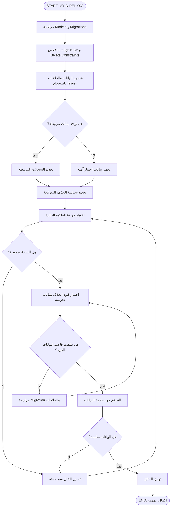
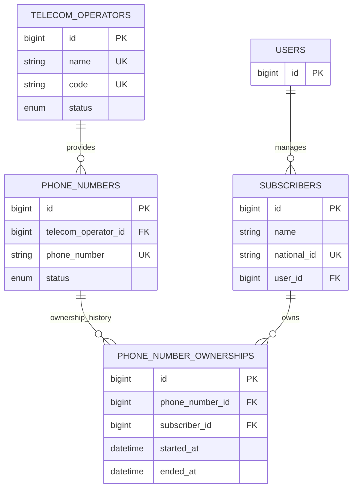
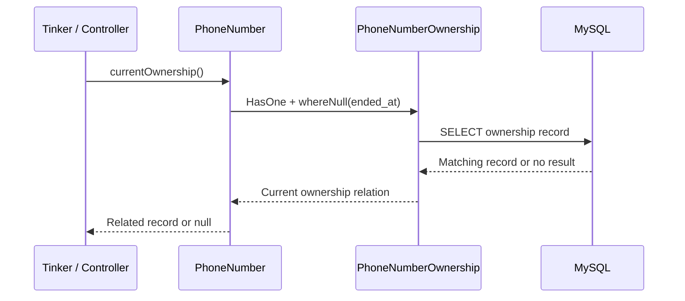
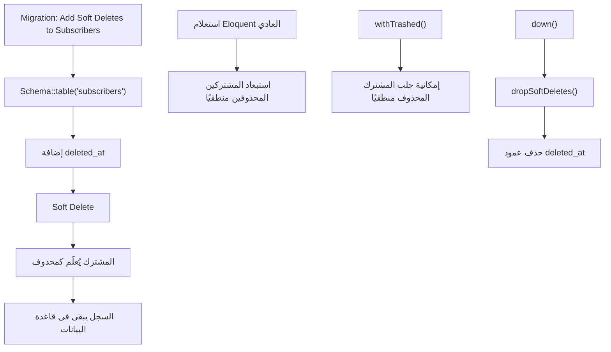
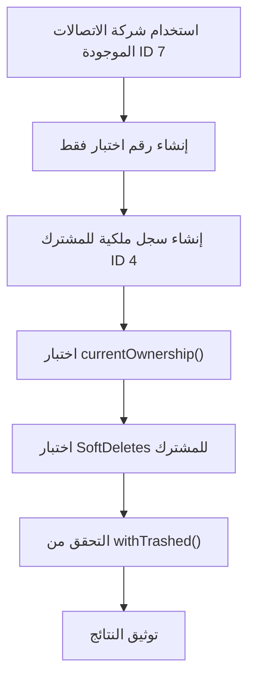
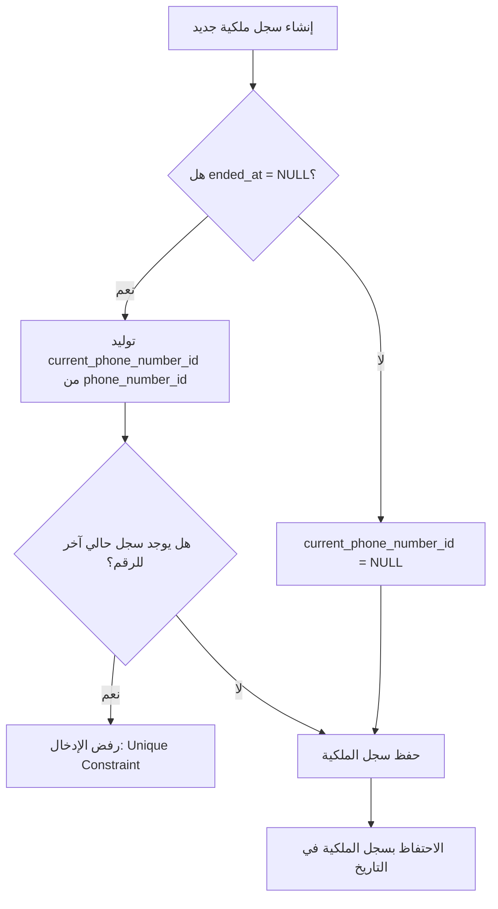

```mermaid
flowchart TD
    A(["START: MYID-REL-002"]) --> B["مراجعة Models و Migrations"]
    B --> C["فحص Foreign Keys و Delete Constraints"]
    C --> D["فحص البيانات والعلاقات باستخدام Tinker"]

    D --> E{"هل توجد بيانات مرتبطة؟"}
    E -->|نعم| F["تحديد السجلات المرتبطة"]
    E -->|لا| G["تجهيز بيانات اختبار آمنة"]
    F --> H["تحديد سياسة الحذف المتوقعة"]
    G --> H

    H --> I["اختبار قراءة الملكية الحالية"]
    I --> J{"هل النتيجة صحيحة؟"}

    J -->|لا| K["تحليل الخلل ومراجعته"]
    K --> I

    J -->|نعم| L["اختبار قيود الحذف ببيانات تجريبية"]
    L --> M{"هل طبقت قاعدة البيانات القيود؟"}

    M -->|لا| N["مراجعة Migration والعلاقات"]
    N --> L

    M -->|نعم| O["التحقق من سلامة البيانات"]
    O --> P{"هل البيانات سليمة؟"}

    P -->|لا| K
    P -->|نعم| Q["توثيق النتائج"]
    Q --> R(["END: إكمال المهمة"])
```

```mermaid
erDiagram
    USERS ||--o{ SUBSCRIBERS : manages
    TELECOM_OPERATORS ||--o{ PHONE_NUMBERS : provides
    PHONE_NUMBERS ||--o{ PHONE_NUMBER_OWNERSHIPS : ownership_history
    SUBSCRIBERS ||--o{ PHONE_NUMBER_OWNERSHIPS : owns

    USERS {
        bigint id PK
    }

    SUBSCRIBERS {
        bigint id PK
        string name
        string national_id UK
        bigint user_id FK
    }

    TELECOM_OPERATORS {
        bigint id PK
        string name UK
        string code UK
        enum status
    }

    PHONE_NUMBERS {
        bigint id PK
        bigint telecom_operator_id FK
        string phone_number UK
        enum status
    }

    PHONE_NUMBER_OWNERSHIPS {
        bigint id PK
        bigint phone_number_id FK
        bigint subscriber_id FK
        datetime started_at
        datetime ended_at
    }
```

```mermaid
sequenceDiagram
    participant T as Tinker / Controller
    participant P as PhoneNumber
    participant O as PhoneNumberOwnership
    participant DB as MySQL

    T->>P: currentOwnership()
    P->>O: HasOne + whereNull(ended_at)
    O->>DB: SELECT ownership record
    DB-->>O: Matching record or no result
    O-->>P: Current ownership relation
    P-->>T: Related record or null
```

```mermaid
flowchart TD
    A["Migration: Add Soft Deletes to Subscribers"] --> B["Schema::table('subscribers')"]
    B --> C["إضافة deleted_at"]
    C --> D["Soft Delete"]

    D --> E["المشترك يُعلَّم كمحذوف"]
    E --> F["السجل يبقى في قاعدة البيانات"]

    G["استعلام Eloquent العادي"] --> H["استبعاد المشتركين المحذوفين منطقيًا"]
    I["withTrashed()"] --> J["إمكانية جلب المشترك المحذوف منطقيًا"]

    K["down()"] --> L["dropSoftDeletes()"]
    L --> M["حذف عمود deleted_at"]
```

```mermaid
flowchart TD
    A["استخدام شركة الاتصالات الموجودة ID 7"] --> B["إنشاء رقم اختبار فقط"]
    B --> C["إنشاء سجل ملكية للمشترك ID 4"]
    C --> D["اختبار currentOwnership()"]
    D --> E["اختبار SoftDeletes للمشترك"]
    E --> F["التحقق من withTrashed()"]
    F --> G["توثيق النتائج"]
```

```mermaid
flowchart TD
    A["إنشاء سجل ملكية جديد"] --> B{"هل ended_at = NULL؟"}
    B -- نعم --> C["توليد current_phone_number_id من phone_number_id"]
    B -- لا --> D["current_phone_number_id = NULL"]
    C --> E{"هل يوجد سجل حالي آخر للرقم؟"}
    E -- نعم --> F["رفض الإدخال: Unique Constraint"]
    E -- لا --> G["حفظ سجل الملكية"]
    D --> G
    G --> H["الاحتفاظ بسجل الملكية في التاريخ"]
```

```mermaid
الكود هنا
```
