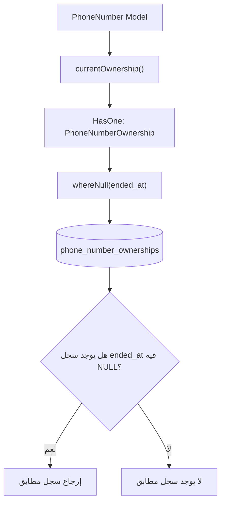
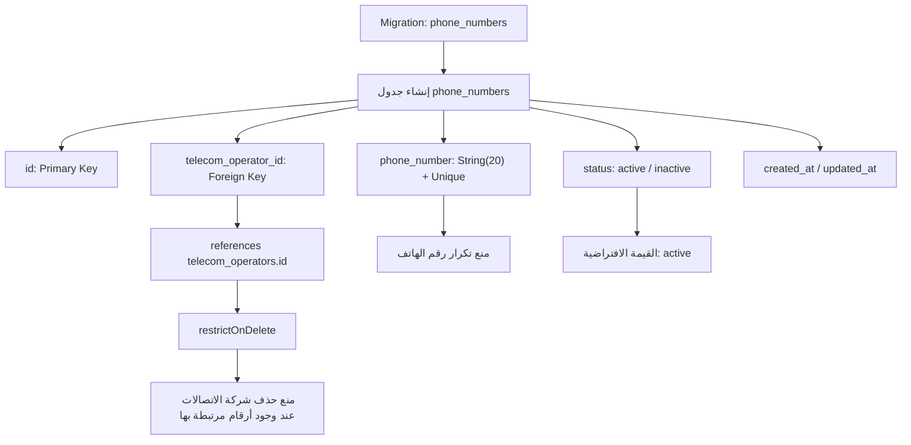
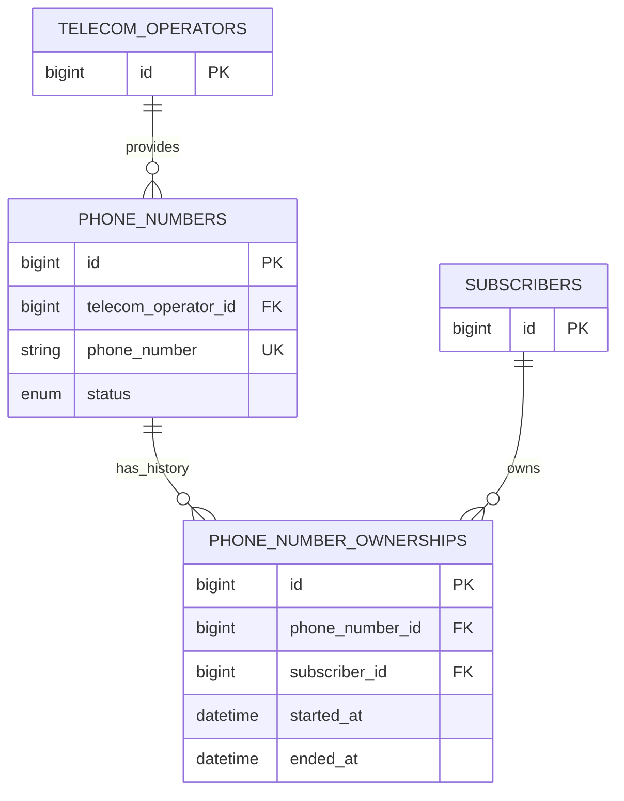
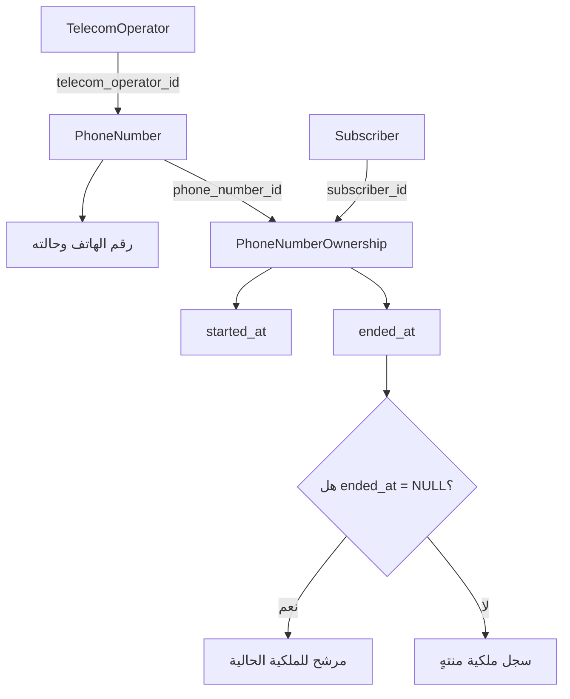

```mermaid
flowchart TD
    A["PhoneNumber Model"] --> B["currentOwnership()"]
    B --> C["HasOne: PhoneNumberOwnership"]
    C --> D["whereNull(ended_at)"]
    D --> E[("phone_number_ownerships")]
    E --> F{"هل يوجد سجل ended_at فيه NULL؟"}
    F -->|نعم| G["إرجاع سجل مطابق"]
    F -->|لا| H["لا يوجد سجل مطابق"]

```

```mermaid
flowchart TD
    A["Migration: phone_numbers"] --> B["إنشاء جدول phone_numbers"]

    B --> C["id: Primary Key"]
    B --> D["telecom_operator_id: Foreign Key"]
    B --> E["phone_number: String(20) + Unique"]
    B --> F["status: active / inactive"]
    B --> G["created_at / updated_at"]

    D --> H["references telecom_operators.id"]
    H --> I["restrictOnDelete"]
    I --> J["منع حذف شركة الاتصالات عند وجود أرقام مرتبطة بها"]

    E --> K["منع تكرار رقم الهاتف"]
    F --> L["القيمة الافتراضية: active"]

```

```mermaid
erDiagram
    TELECOM_OPERATORS ||--o{ PHONE_NUMBERS : provides
    PHONE_NUMBERS ||--o{ PHONE_NUMBER_OWNERSHIPS : has_history
    SUBSCRIBERS ||--o{ PHONE_NUMBER_OWNERSHIPS : owns

    TELECOM_OPERATORS {
        bigint id PK
    }

    PHONE_NUMBERS {
        bigint id PK
        bigint telecom_operator_id FK
        string phone_number UK
        enum status
    }

    SUBSCRIBERS {
        bigint id PK
    }

    PHONE_NUMBER_OWNERSHIPS {
        bigint id PK
        bigint phone_number_id FK
        bigint subscriber_id FK
        datetime started_at
        datetime ended_at
    }
```

```mermaid
flowchart TD
    A["TelecomOperator"] -->|"telecom_operator_id"| B["PhoneNumber"]
    B --> C["رقم الهاتف وحالته"]
    B -->|"phone_number_id"| D["PhoneNumberOwnership"]
    E["Subscriber"] -->|"subscriber_id"| D
    D --> F["started_at"]
    D --> G["ended_at"]

    G --> H{"هل ended_at = NULL؟"}
    H -->|نعم| I["مرشح للملكية الحالية"]
    H -->|لا| J["سجل ملكية منتهٍ"]
```
