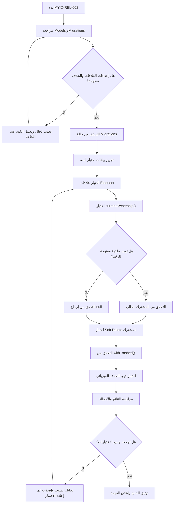

```mermaid
flowchart TD
    A["بدء MYID-REL-002"] --> B["مراجعة Models وMigrations"]
    B --> C{"هل إعدادات العلاقات والحذف صحيحة؟"}

    C -- "لا" --> D["تحديد الخلل وتعديل الكود عند الحاجة"]
    D --> B

    C -- "نعم" --> E["التحقق من حالة Migrations"]
    E --> F["تجهيز بيانات اختبار آمنة"]
    F --> G["اختبار علاقات Eloquent"]

    G --> H["اختبار currentOwnership()"]
    H --> I{"هل توجد ملكية مفتوحة للرقم؟"}

    I -- "نعم" --> J["التحقق من المشترك الحالي"]
    I -- "لا" --> K["التحقق من إرجاع null"]

    J --> L["اختبار Soft Delete للمشترك"]
    K --> L

    L --> M["التحقق من withTrashed()"]
    M --> N["اختبار قيود الحذف الفيزيائي"]
    N --> O["مراجعة النتائج والأخطاء"]
    O --> P{"هل نجحت جميع الاختبارات؟"}

    P -- "لا" --> Q["تحليل السبب وإصلاحه ثم إعادة الاختبار"]
    Q --> G

    P -- "نعم" --> R["توثيق النتائج وإغلاق المهمة"]


```

```mermaid
الكود هنا
```

```mermaid
الكود هنا
```
