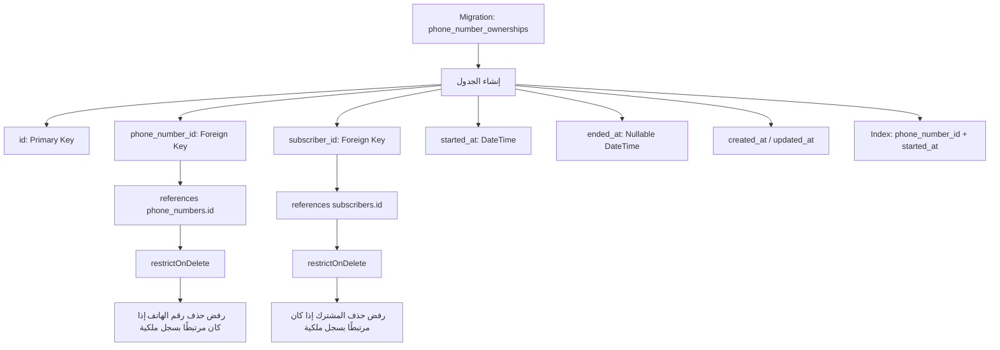
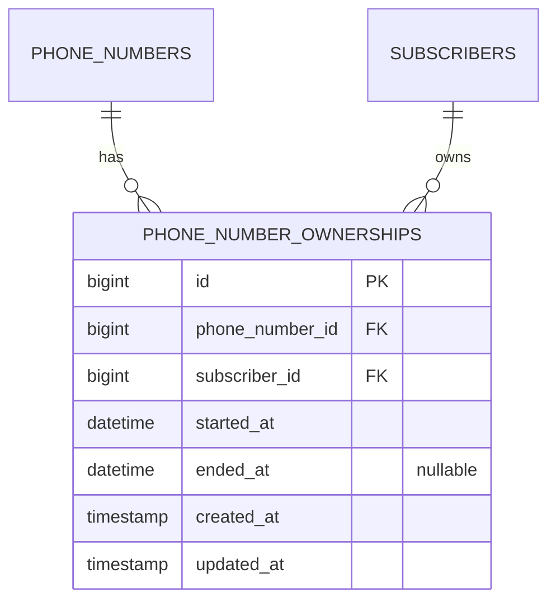

```mermaid
flowchart TD
A["Migration: phone_number_ownerships"] --> B["إنشاء الجدول"]
B --> C["id: Primary Key"]
B --> D["phone_number_id: Foreign Key"]
B --> E["subscriber_id: Foreign Key"]
B --> F["started_at: DateTime"]
B --> G["ended_at: Nullable DateTime"]
B --> H["created_at / updated_at"]
B --> I["Index: phone_number_id + started_at"]

    D --> J["references phone_numbers.id"]
    E --> K["references subscribers.id"]

    J --> L["restrictOnDelete"]
    K --> M["restrictOnDelete"]

    L --> N["رفض حذف رقم الهاتف إذا كان مرتبطًا بسجل ملكية"]
    M --> O["رفض حذف المشترك إذا كان مرتبطًا بسجل ملكية"]
```

```mermaid
erDiagram
    PHONE_NUMBERS ||--o{ PHONE_NUMBER_OWNERSHIPS : has
    SUBSCRIBERS ||--o{ PHONE_NUMBER_OWNERSHIPS : owns

    PHONE_NUMBER_OWNERSHIPS {
        bigint id PK
        bigint phone_number_id FK
        bigint subscriber_id FK
        datetime started_at
        datetime ended_at "nullable"
        timestamp created_at
        timestamp updated_at
    }

```
